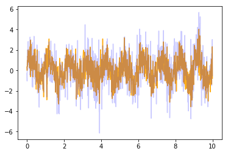
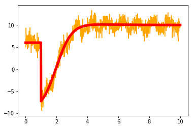
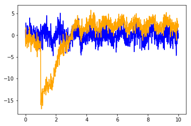

# Understanding signals and confounds

## Introduction

Modern neuroscience relies on correlational analyses. In some clinical settings, rapid visual inspection of correlations serves as the basis for identification of biometrics. This approach, however, is severely flawed. In this notebook, we will outline a very simple instance where visual inspection can be very misleading and why the modern tools of signal processing must be used to properly analyse electrophysiology.

## Overview

## Notebook Background

This notebook is meant to be interactive. You can also extract the code and run it on your own in a separate script. You'll see codeblocks like the one below that set up the general environment for the code.


```python
%reset

import numpy as np
import matplotlib.pyplot as plt

import sklearn
```

    Once deleted, variables cannot be recovered. Proceed (y/[n])? y


## Setting up the model

### Ephys to Disease

We will start with a very simple model of how an electrophysiology feature is tied/correlated with disease


```python
#The model tying electrophysiology feature to disease
M = np.ones((1,1))

```

This is a trivial model where the disease severity is just the same value as the electrophysiology feature. For the purpose of this study, this will work. Now, let's build some timecourses observed from this synthetic model.


```python
t = np.linspace(0,10,1000)

e = np.random.normal(0,1,(1,1000)) + np.sin(2 * np.pi * t)

d = M * e + np.random.normal(0,1,(1,1000))

plt.plot(t,e[0,:],label='Ephys',color='orange',alpha=0.9)
plt.plot(t,d[0,:],label='Disease',color='blue',alpha=0.2)
plt.show()

#actual correlation
print('The actual correlation between our true ephys and disease measure is ' + str(np.corrcoef(e,d)[0,1]))
```





    The actual correlation between our true ephys and disease measure is 0.762675314788


Now we're going to add a simple, predefined confound. This will be shaped in a way inspired by the impedance settling of a clinical DBS implanted device.


```python
#we'll add a piecewise linear confound
imp_conf = 10* np.tanh(t-2) + t**2 * np.exp(-t)

imp_conf[0:100] = 6

y = e + imp_conf


plt.plot(t,y[0,:],color='orange')
plt.plot(t,imp_conf,linewidth=5,color='red')
plt.show()
```





The red curve is the impedance confound. It is added to the true electrophysiology we defined above.


```python
plt.plot(t,d[0,:],color='blue')
plt.plot(t,y[0,:],color='orange')

plt.show()

#zero the means
y = y - np.mean(y)
d = d - np.mean(d)

#calculate the correlation between the two
print('The correlation between our measured ephys and our disease is ' + str(np.corrcoef(d,y)[0,1]))
```





    The correlation between our measured ephys and our disease is 0.203994844794

